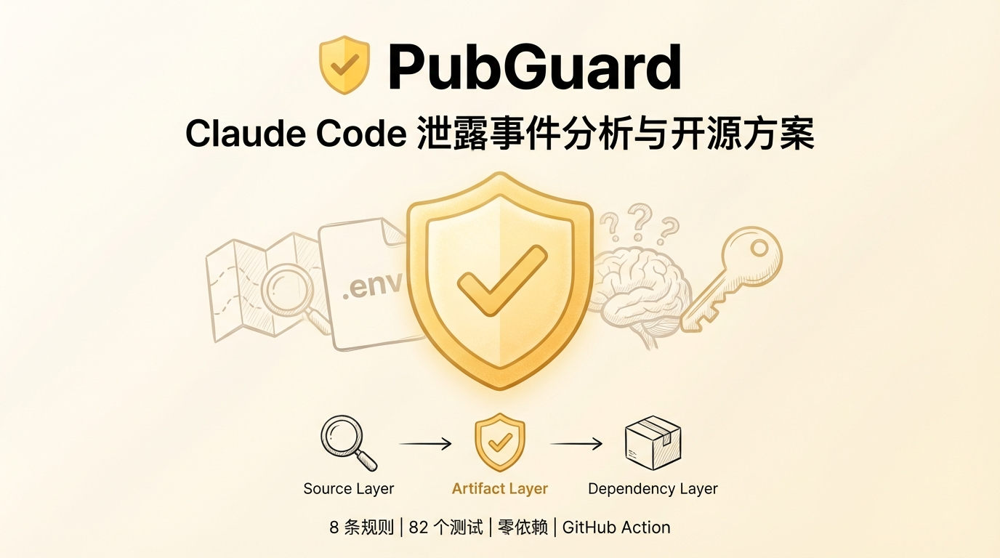
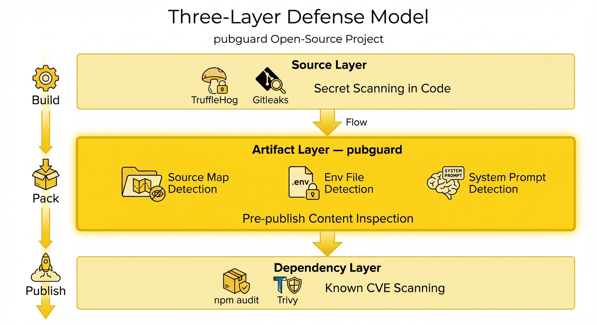
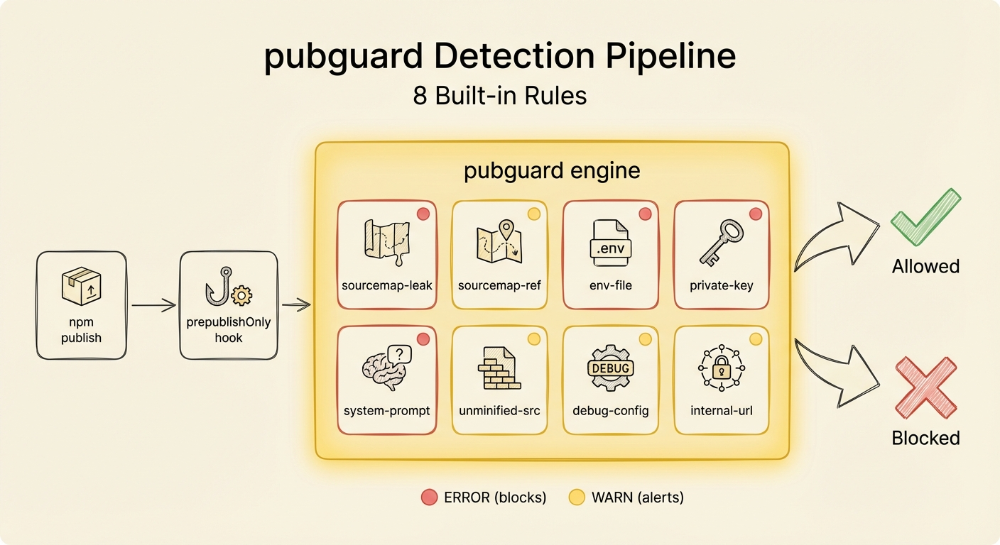

<div align="center">
  

  <h1>PubGuard</h1>

  <p><strong>Guard what you publish.</strong></p>

  <p><strong>Source Map Leak Detection</strong> | <strong>System Prompt Exposure</strong> | <strong>Sensitive File Guard</strong></p>

  <p>
    <a href="LICENSE"></a>
    <a href="https://nodejs.org"></a>
    
    <a href="https://www.npmjs.com/package/pubguard"></a>
  </p>

  <p><strong>English</strong> | <a href="./README.zh-CN.md">中文</a></p>
</div>

---

Born from the [Claude Code source map leak](https://dev.to/gabrielanhaia/claude-codes-entire-source-code-was-just-leaked-via-npm-source-maps-heres-whats-inside-cjo) — a 57 MB `.map` file exposed 512K lines of proprietary code on npm. No tool caught it. **PubGuard would have.**

<picture>
  
</picture>

## Quick Start

```bash
git clone https://github.com/MRT-8/pubguard.git
cd pubguard
npm install
npm run build
```

**Scan your project:**

```bash
node dist/cli.js check --dry-run            # scan what npm would publish
node dist/cli.js check my-pkg.tgz --strict  # scan a tarball, fail on errors
```

**Or install globally / via npx (after publishing to npm):**

```bash
npx pubguard check --dry-run
```

**Add to your publish workflow (recommended):**

```bash
npm install -D pubguard
npm pkg set scripts.prepublishOnly="pubguard check --dry-run --strict"
```

Now `npm publish` automatically runs PubGuard first. Errors block the publish.

## What It Detects

- **`sourcemap-leak`** &mdash; `.map` files with `sourcesContent` — full source code exposure
- **`sourcemap-reference`** &mdash; `sourceMappingURL` comments pointing to map files
- **`env-file`** &mdash; `.env`, `.npmrc`, `credentials.json`, SSH configs
- **`private-key`** &mdash; `.pem`, `.key`, `id_rsa`, PEM-encoded private keys
- **`system-prompt`** &mdash; AI system prompts embedded in published code
- **`unminified-source`** &mdash; Large unminified JS files (likely unbundled source)
- **`debug-config`** &mdash; `debug: true`, `NODE_ENV=development` left in builds
- **`internal-url`** &mdash; Internal/corporate URLs (`*.internal.*`, private IPs)

## Why PubGuard?

Existing tools find secrets in code or vulnerabilities in dependencies. Nobody checks **what's actually inside your published package**:

<p align="center">
  
</p>

| | Secrets in code | Source map leak | System prompt leak | .env in package |
|---|:---:|:---:|:---:|:---:|
| TruffleHog / Gitleaks | ✅ | ❌ | ❌ | ❌ |
| npm audit | ❌ | ❌ | ❌ | ❌ |
| **PubGuard** | — | ✅ | ✅ | ✅ |

<details>
<summary><b>Configuration</b></summary>

```jsonc
// .pubguardrc.json
{
  "rules": {
    "sourcemap-leak": "error",    // "error" | "warn" | "info" | "off"
    "system-prompt": "error",
    "env-file": "error",
    "private-key": "error",
    "sourcemap-reference": "warn",
    "unminified-source": "warn",
    "debug-config": "warn",
    "internal-url": "warn"
  },
  "ignore": ["dist/vendor/**"],
  "thresholds": {
    "max-package-size": "10MB",
    "max-file-size": "5MB"
  }
}
```

</details>

<details>
<summary><b>Custom Rules</b></summary>

Create `.pubguard-rules/my-rule.js`:

```javascript
export default {
  id: 'my-custom-rule',
  defaultSeverity: 'warn',
  description: 'Detect something specific to my project',
  detect(file) {
    const results = [];
    if (file.path.endsWith('.secret')) {
      results.push({
        ruleId: 'my-custom-rule',
        severity: 'error',
        message: `Secret file found: ${file.path}`,
        file: file.path,
        fix: 'Remove this file from the package',
      });
    }
    return results;
  },
};
```

</details>

<details>
<summary><b>CI/CD Integration</b></summary>

**GitHub Actions:**

```yaml
- name: Check publish safety
  uses: pubguard/action@v1
  with:
    strict: true
```

**Or directly:**

```yaml
- run: npx pubguard check --dry-run --strict
```

**Combined with secret scanning:**

```yaml
- run: npx pubguard check --dry-run --strict  # artifact content
- run: trufflehog filesystem . --fail          # secrets
- run: npm publish --provenance                # publish with SLSA
```

**SARIF for GitHub Code Scanning:**

```yaml
- run: npx pubguard check --dry-run --format sarif --output pubguard.sarif
- uses: github/codeql-action/upload-sarif@v3
  with:
    sarif_file: pubguard.sarif
```

</details>

<details>
<summary><b>CLI Reference</b></summary>

```
pubguard check [file.tgz] [options]
pubguard init                        # create .pubguardrc.json

Options:
  --dry-run        Scan files npm would publish (no .tgz needed)
  --strict         Exit 1 on any error
  --format <fmt>   text (default), json, sarif
  --output <file>  Write report to file
  --config <path>  Custom config path
```

</details>

## How It Works

<p align="center">
  
</p>

1. Reads your package contents (via `npm pack --dry-run` or `.tgz` file)
2. Runs each file through 8 detection rules
3. Reports findings with severity + fix suggestions
4. Exits non-zero if errors found &rarr; blocks `npm publish`

Zero dependencies. All local. No data leaves your machine.

## License

[Apache-2.0](LICENSE)
